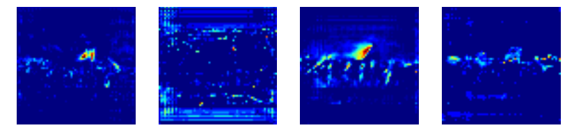
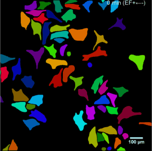
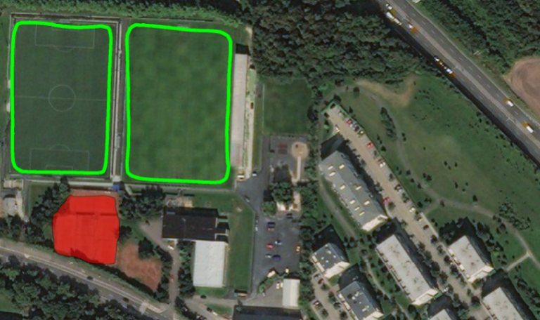

# Leather Detection (皮革瑕疵檢測)
1. 以Mask R-CNN進行物件檢測，此安裝方法同下面步驟。
2. [leather.py](samples/leather/leather.py) 使用`Python 3` 訓練皮革的數據集上的Mask R-CNN，訓練設定中會使用到`mask_rcnn_coco.h5`此權重檔，訓練完成後會產生新的權重檔在`logs/`下方的新增目錄中。
3. [predict.ipynb](samples/leather/predict.ipynb) 皮革物件的預測，使用筆記程式在皮革的數據集上的Mask R-CNN。
4. [run_cam-leather.ipynb](samples/leather/run_cam-leather.ipynb) 皮革物件的動態即時影像預測，此功能需要先使用步驟二，訓練完成的權重檔，會儲存在`logs/`下面的目錄中，並填入程式中對於weight h5權重的設定路徑。
4-1. 執行`run_cam-leather.ipynb`或相關Mask R-CNN Model程式時需要呼叫`config.ini`，此設定是經由[config.py](mrcnn/config.py)程式所呼叫的設定內容，`config.ini`檔案內容結構如下:
```
[Config]
Augmentation=False
Augment=False
USE_MINI_MASK=False
```
5. 此皮革訓練使用的是Mask R-CNN網路結構，使用Trensfer Learning，而程式中的權重檔則來自[./mask_rcnn_coco.h5](https://github.com/matterport/Mask_RCNN/releases/download/v2.0/mask_rcnn_coco.h5)。
6. [訓練資料](https://tn00343140a.pixnet.net/blog/post/319064126-mask-rcnn%E4%BD%BF%E7%94%A8%E7%AF%87) 的準備說明
7. [Mask_RCNN in Tensorflow2](https://github.com/ahmedfgad/Mask-RCNN-TF2)

# Mask R-CNN for Object Detection and Segmentation

這是[Mask R-CNN]（https://arxiv.org/abs/1703.06870） 在Python 3 以Keras和TensorFlow2 以上的實做。 該模型為圖像中對象的每個物件生成邊界框( bounding boxes)和語意分割罩(segmentation masks)，它基於功能金字塔網絡（Feature Pyramid Network, FPN）和ResNet101主幹網。


存儲庫內包括：
*基於FPN和ResNet101構建的Mask R-CNN的源代碼。
* MS COCO的培訓代碼
* MS COCO的預訓練砝碼
* Jupyter筆記本電腦可在每個步驟可視化檢測管線
* ParallelModel類用於多GPU訓練
*評估MS COCO指標（AP）
*對您自己的數據集進行培訓(training)的範例

該代碼已記錄並設計為易於延伸，如果您在研究中使用它，請考慮引用該存儲庫（下面的bibtex）。 如果您從事3D視覺工作，您可能會發現我們最近發布的[Matterport3D]（https://matterport.com/blog/2017/09/20/announcing-matterport3d-research-dataset/） 數據集也很有用。
此數據集是由我們的客戶捕獲的3D重構空間創建的，這些客戶同意將其公開提供給學術用途。 您可以在[此處]（https://matterport.com/gallery/） 上看到更多範例。

# Getting Started
* [demo.ipynb](samples/demo.ipynb) 是最簡單的開始方式，它顯示了一個範例，該範例使用在MS COCO上進行預訓練(pre-trained)的模型來分割您自己的圖像中的對象。
它包括在任意圖像上運行對象檢測(detection)和以物件為例來分割(instance segmentation)的代碼。

* [train_shapes.ipynb](samples/shapes/train_shapes.ipynb) 顯示瞭如何在自己的數據集上訓練Mask R-CNN，
此筆記範例介紹了玩具數據集（Shapes），以演示對新數據集的訓練。

* ([model.py](mrcnn/model.py), [utils.py](mrcnn/utils.py), [config.py](mrcnn/config.py)): 這些文件包含主要的Mask RCNN實現。 
These files contain the main Mask RCNN implementation. 


* [inspect_data.ipynb](samples/coco/inspect_data.ipynb). 此筆記程式可視化了準備培訓數據的不同預處理步驟。
This notebook visualizes the different pre-processing steps to prepare the training data.

* [inspect_model.ipynb](samples/coco/inspect_model.ipynb) 此筆記程式深入介紹了檢測和分割對象所執行的步驟，它提供了程序管道中每個步驟的可視化。
This notebook goes in depth into the steps performed to detect and segment objects. It provides visualizations of every step of the pipeline.

* [inspect_weights.ipynb](samples/coco/inspect_weights.ipynb) 該筆記本檢查經過訓練的模型的權重，並查找異常和奇怪的模式。
This notebooks inspects the weights of a trained model and looks for anomalies and odd patterns.


# Step by Step Detection
為了幫助調試和理解模型，有3個筆記程式
([inspect_data.ipynb](samples/coco/inspect_data.ipynb), [inspect_model.ipynb](samples/coco/inspect_model.ipynb),
[inspect_weights.ipynb](samples/coco/inspect_weights.ipynb)) 提供大量的可視化效果，並允許逐步運行模型以檢查每個點的輸出。 這裡有一些例子：
that provide a lot of visualizations and allow running the model step by step to inspect the output at each point. Here are a few examples:


## 1. Anchor sorting and filtering
可視化第一階段區域建議網絡的每個步驟，並顯示正、負錨框以及錨框的細節。
Visualizes every step of the first stage Region Proposal Network and displays positive and negative anchors along with anchor box refinement.


## 2. Bounding Box Refinement
這是最終檢測框（虛線）的範例，並在第二階段對其進行了改進（solid lines）。
This is an example of final detection boxes (dotted lines) and the refinement applied to them (solid lines) in the second stage.


## 3. Mask Generation
生成罩範例。 然後將它們縮放並放置在正確位置的圖像上。
Examples of generated masks. These then get scaled and placed on the image in the right location.


## 4.Layer activations
通常用來檢查不同層的激活以查找故障跡象（all zeros or random noise）通常很有用。
Often it's useful to inspect the activations at different layers to look for signs of trouble (all zeros or random noise).



## 5. Weight Histograms
另一個有用的調試工具是檢查權重直方圖(weight histograms)。 這些都包含在inspect_weights.ipynb筆記程式中。
Another useful debugging tool is to inspect the weight histograms. These are included in the inspect_weights.ipynb notebook.


## 6. Logging to TensorBoard
TensorBoard是另一個出色的調試和可視化工具，該模型配置為記錄損失並在每個時期結束時儲存權重。
TensorBoard is another great debugging and visualization tool. The model is configured to log losses and save weights at the end of every epoch.


## 7. Composing the different pieces into a final result
將不同的片段組合成最終結果


# Training on MS COCO
我們正在為MS COCO提供預先訓練的砝碼，以使其易於啟動。 您可以將這些權重用作在網絡上訓練自己的變體的起點。
培訓和評估代碼在`samples/coco/coco.py`中。 您可以在Jupyter筆記本中導入此模型（有關範例，請參閱提供的筆記程式），也可以直接從命令行運行它，如下所示：

```
# Train a new model starting from pre-trained COCO weights
python3 samples/coco/coco.py train --dataset=/path/to/coco/ --model=coco

# Train a new model starting from ImageNet weights
python3 samples/coco/coco.py train --dataset=/path/to/coco/ --model=imagenet

# Continue training a model that you had trained earlier
python3 samples/coco/coco.py train --dataset=/path/to/coco/ --model=/path/to/weights.h5

# Continue training the last model you trained. This will find
# the last trained weights in the model directory.
python3 samples/coco/coco.py train --dataset=/path/to/coco/ --model=last
```
您還可以使用以下命令運行COCO評估代碼：
You can also run the COCO evaluation code with:
```
# Run COCO evaluation on the last trained model
python3 samples/coco/coco.py evaluate --dataset=/path/to/coco/ --model=last
```

訓練時間表、學習率和其他參數應在`samples/coco/coco.py`中設置。
The training schedule, learning rate, and other parameters should be set in `samples/coco/coco.py`.


# Training on Your Own Dataset

首先閱讀此[有關氣球顏色飛濺示例的博客文章]（https://engineering.matterport.com/splash-of-color-instance-segmentation-with-mask-r-cnn-and-tensorflow-7c761e238b46）。 它涵蓋了從註釋圖像到訓練再到在示例應用程序中使用結果的過程。

總之，要在自己的數據集上訓練模型，您需要延伸兩個類別：

```Config```
此類包含預設配置。 對其進行子項類別化(Subclass)，然後修改您需要更改的屬性。

```Dataset```
這個類別提供了使用任何數據集的一致方式。
它允許您使用新的數據集進行訓練，而無需更改模型的程式碼，
它還支持同時加載多個數據集，如果要檢測的對像在一個數據集中並非全部可用，這將很有用。

See examples in `samples/shapes/train_shapes.ipynb`, `samples/coco/coco.py`, `samples/balloon/balloon.py`, and `samples/nucleus/nucleus.py`.

## Differences from the Official Paper
此部分實現大部分遵循Mask RCNN論文內容，但是在少數情況下，我們偏向於程式碼簡單和通用化。這些是我們知道的一些差異。如果您遇到其他差異，請告訴我們。

* **Image Resizing:**
為了支持每批訓練多張圖像，我們將所有圖像調整為相同大小。例如，在MS COCO上為1024x1024px。我們保留寬高比，因此，如果圖像不是正方形，則將其填充為零。在本文中，進行了調整大小，以使最小的一面為800像素，最大的一面為1000像素。

* **Bounding Boxes:** 有些數據集提供邊界框，有些僅提供蒙版。為了支持對多個數據集的訓練，我們選擇忽略數據集隨附的邊界框，而是動態生成它們。我們選擇封裝蒙版所有像素的最小框作為邊界框。這簡化了實現，並且還易於應用圖像增強，而圖像增強在其他情況下很難應用於邊界框，例如圖像旋轉。

    為了驗證這種方法，我們將計算出的邊界框與COCO數據集提供的邊界框進行了比較。
我們發現〜2％的邊界框相差1px或更多，〜0.05％的邊界框相差5px或更多，
並且只有0.01％相差10像素或更多。

* **Learning Rate:** 本文使用的學習率為0.02，但我們發現
太高，通常會導致重量爆炸，尤其是在使用小批量時
尺寸。這可能與Caffe和TensorFlow的計算方式之間的差異有關
梯度（批次與GPU之間的總和與均值）。或者，也許官方模型使用漸變
裁剪以避免此問題。我們確實使用了梯度裁剪，但不要設置得太過激。
我們發現較小的學習率反而會收斂得更快，因此我們繼續這樣做。

## Citation
使用此bibtex引用此存儲庫：
Use this bibtex to cite this repository:
```
@misc{matterport_maskrcnn_2017,
  title={Mask R-CNN for object detection and instance segmentation on Keras and TensorFlow},
  author={Waleed Abdulla},
  year={2017},
  publisher={Github},
  journal={GitHub repository},
  howpublished={\url{https://github.com/matterport/Mask_RCNN}},
}
```

## Contributing
歡迎對該存儲庫做出貢獻。 您可以做出貢獻的示例：
*速度改進，就像在 TensorFlow或 Cython中重寫一些Python代碼一樣。
*訓練其他數據集。
*準確性提高。
*可視化和範例。

You can also [join our team](https://matterport.com/careers/) and help us build even more projects like this one.

## Requirements
Python 3.7.8, TensorFlow 2.3.0, Keras 2.4.0, Numpy 1.18.5, cudnn 7.6.5(Conda), cudatoolkit 10.1.243(Conda) and other common packages listed in `requirements.txt`.

### MS COCO Requirements:
要對MS COCO進行培訓或測試，您還需要：
* pycocotools (下面的安裝說明)
* [MS COCO Dataset](http://cocodataset.org/#home)
* Download the 5K [minival](https://dl.dropboxusercontent.com/s/o43o90bna78omob/instances_minival2014.json.zip?dl=0)
  and the 35K [validation-minus-minival](https://dl.dropboxusercontent.com/s/s3tw5zcg7395368/instances_valminusminival2014.json.zip?dl=0)
  子集(Subsets)，原資料中的更多細節 [Faster R-CNN implementation](https://github.com/rbgirshick/py-faster-rcnn/blob/master/data/README.md).

If you use Docker, the code has been verified to work on
[this Docker container](https://hub.docker.com/r/waleedka/modern-deep-learning/).


## Installation
1. 克隆(Clone)此存儲庫
2. 安裝依賴項與套件
   ```bash
   pip3 install -r requirements.txt
   ```
3. 從存儲庫根目錄運行安裝程序
    ```bash
    python3 setup.py install
    ``` 
4. 從[發布頁面]（https://github.com/matterport/Mask_RCNN/releases） 下載預訓練的COCO權重（mask_rcnn_coco.h5）。
5. （可選）要在MS COCO上進行培訓或測試，請從這些存儲庫之一安裝`pycocotools`。 它們是原始pycocotools的分支，具有針對Python3和Windows的修復（官方倉庫似乎不再處於活動狀態）。

    * Linux: https://github.com/waleedka/coco
    * Windows: https://github.com/philferriere/cocoapi.
    您必須在路徑上具有Visual C ++ 2015生成工具（有關更多詳細信息，請參見repo）

# Projects Using this Model
如果您將此模型延伸到其他數據集或構建使用該模型的項目，we'd love to hear from you.

### [4K Video Demo](https://www.youtube.com/watch?v=OOT3UIXZztE) by Karol Majek.
[](https://www.youtube.com/watch?v=OOT3UIXZztE)

### [Images to OSM](https://github.com/jremillard/images-to-osm): Improve OpenStreetMap by adding baseball, soccer, tennis, football, and basketball fields.


### [Splash of Color](https://engineering.matterport.com/splash-of-color-instance-segmentation-with-mask-r-cnn-and-tensorflow-7c761e238b46). A blog post explaining how to train this model from scratch and use it to implement a color splash effect.


### [Segmenting Nuclei in Microscopy Images](samples/nucleus). Built for the [2018 Data Science Bowl](https://www.kaggle.com/c/data-science-bowl-2018)
Code is in the `samples/nucleus` directory.


### [Detection and Segmentation for Surgery Robots](https://github.com/SUYEgit/Surgery-Robot-Detection-Segmentation) by the NUS Control & Mechatronics Lab.


### [Reconstructing 3D buildings from aerial LiDAR](https://medium.com/geoai/reconstructing-3d-buildings-from-aerial-lidar-with-ai-details-6a81cb3079c0)
A proof of concept project by [Esri](https://www.esri.com/), in collaboration with Nvidia and Miami-Dade County. Along with a great write up and code by Dmitry Kudinov, Daniel Hedges, and Omar Maher.


### [Usiigaci: Label-free Cell Tracking in Phase Contrast Microscopy](https://github.com/oist/usiigaci)
A project from Japan to automatically track cells in a microfluidics platform. Paper is pending, but the source code is released.

 

### [Characterization of Arctic Ice-Wedge Polygons in Very High Spatial Resolution Aerial Imagery](http://www.mdpi.com/2072-4292/10/9/1487)
Research project to understand the complex processes between degradations in the Arctic and climate change. By Weixing Zhang, Chandi Witharana, Anna Liljedahl, and Mikhail Kanevskiy.


### [Mask-RCNN Shiny](https://github.com/huuuuusy/Mask-RCNN-Shiny)
A computer vision class project by HU Shiyu to apply the color pop effect on people with beautiful results.


### [Mapping Challenge](https://github.com/crowdAI/crowdai-mapping-challenge-mask-rcnn): Convert satellite imagery to maps for use by humanitarian organisations.


### [GRASS GIS Addon](https://github.com/ctu-geoforall-lab/i.ann.maskrcnn) to generate vector masks from geospatial imagery. Based on a [Master's thesis](https://github.com/ctu-geoforall-lab-projects/dp-pesek-2018) by Ondřej Pešek.

